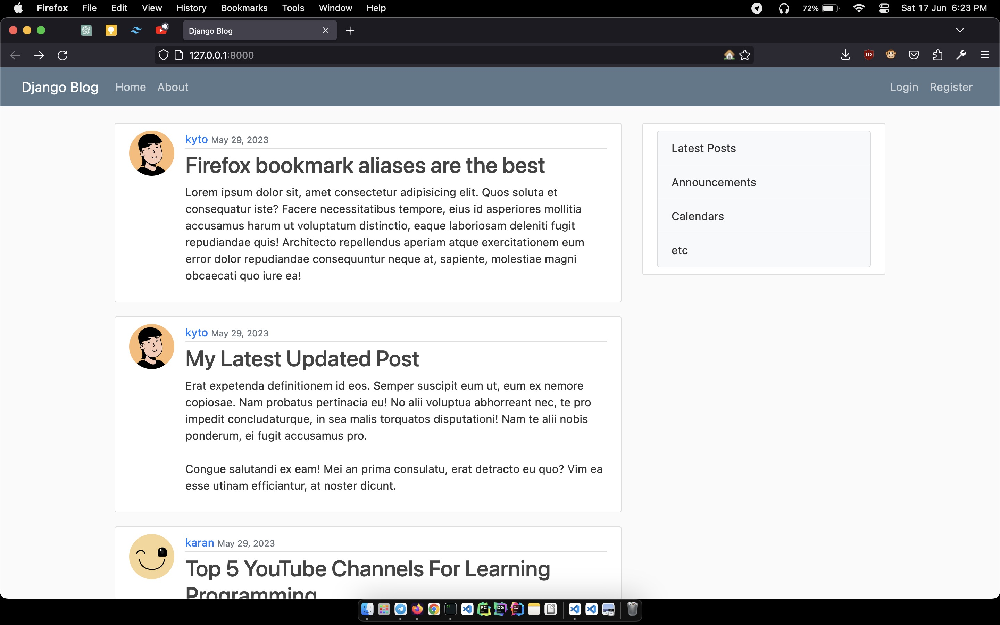
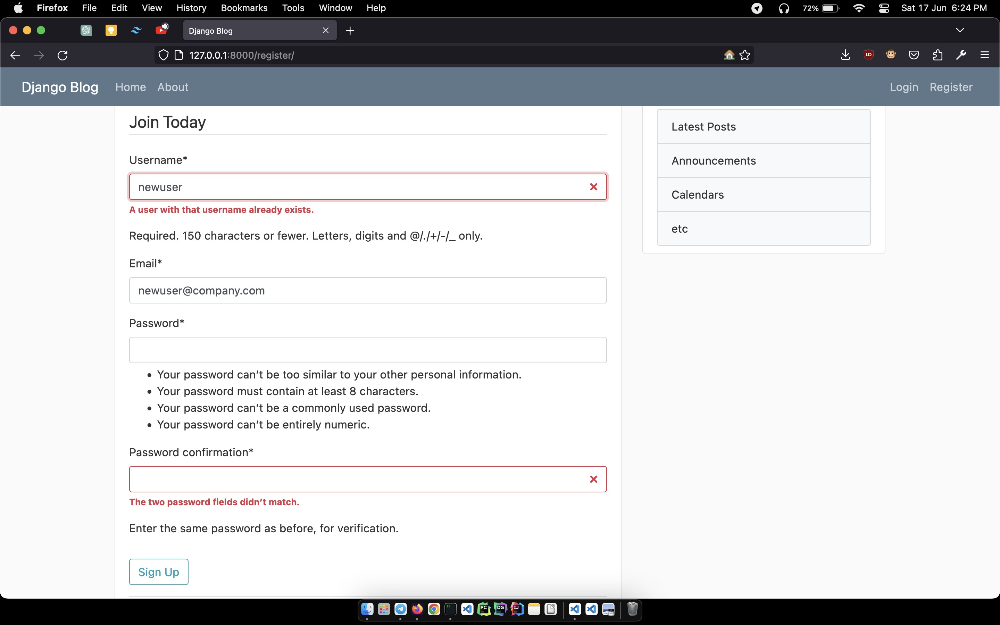
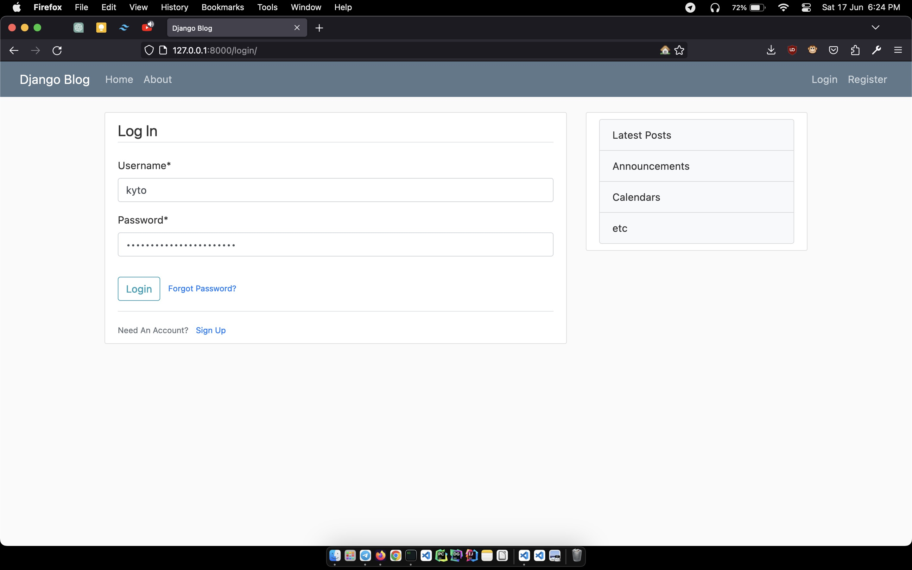
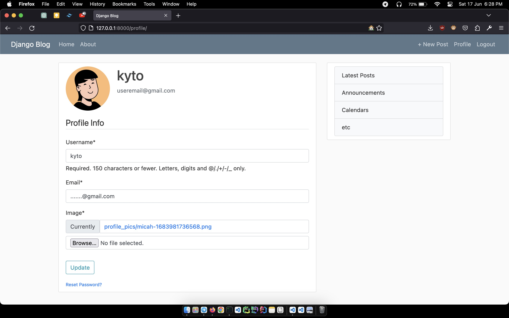
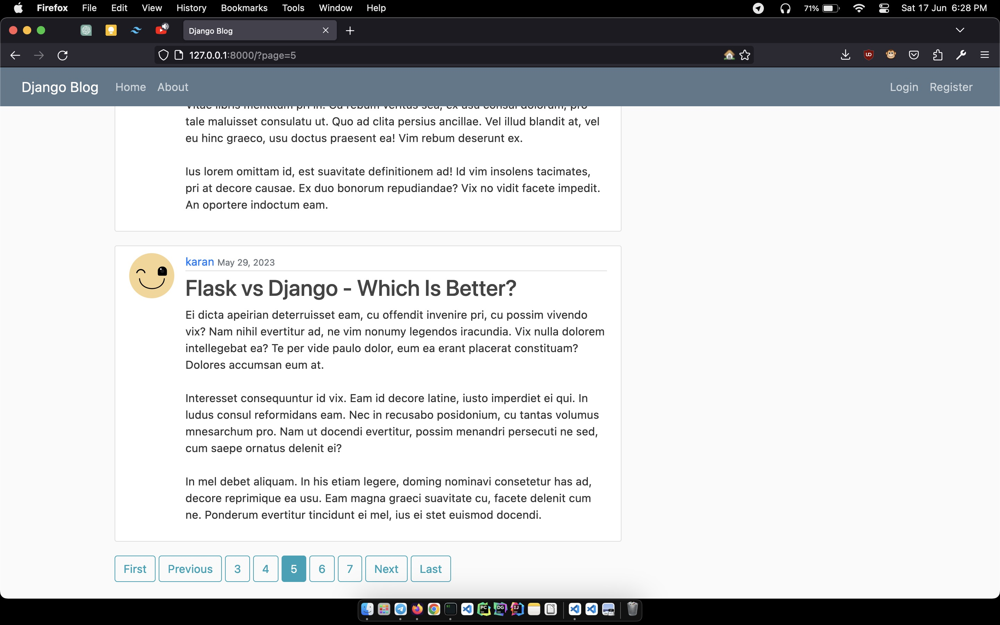
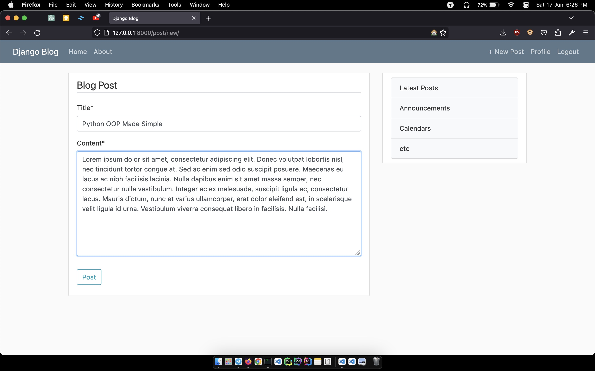
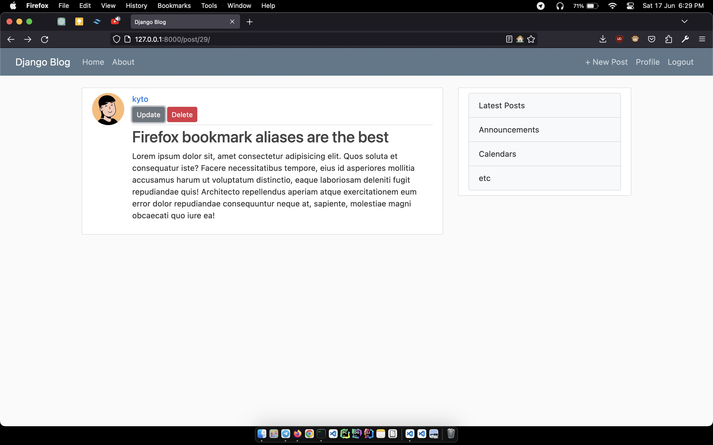
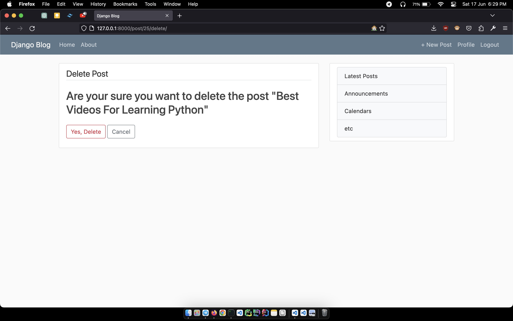
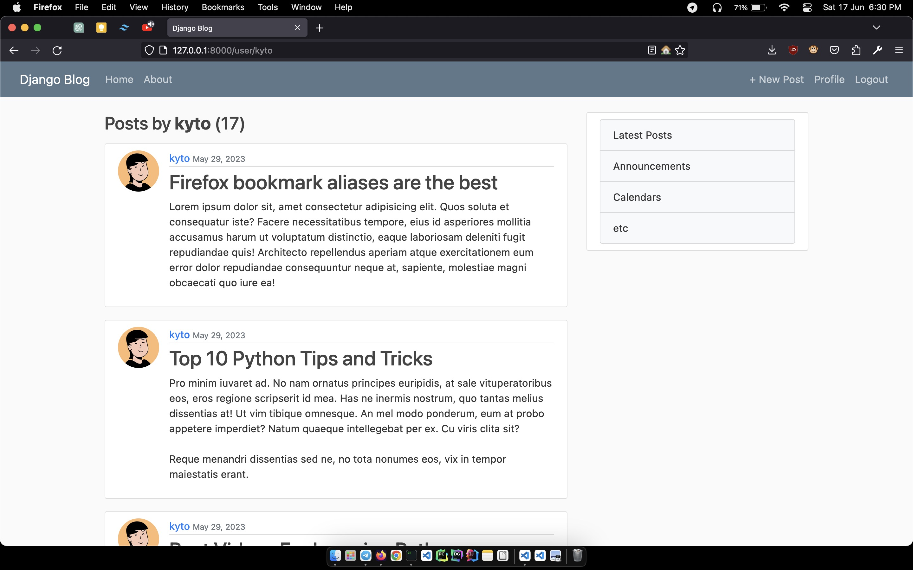
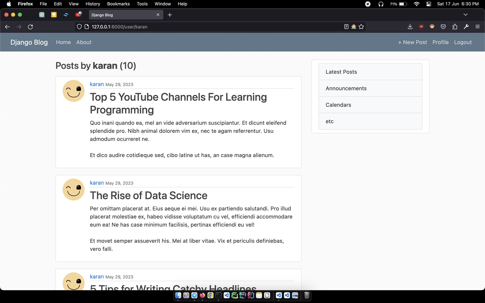

# Multi user django blog

## Dependencies
<pre>
  pip install django-crispy-forms
  pip install crispy-bootstrap5
  pip install Pillow
</pre>

## Screenshots
- Home

- Register

- Login

- User Profile

- Pagination

- CRUD

- Posts Filter

